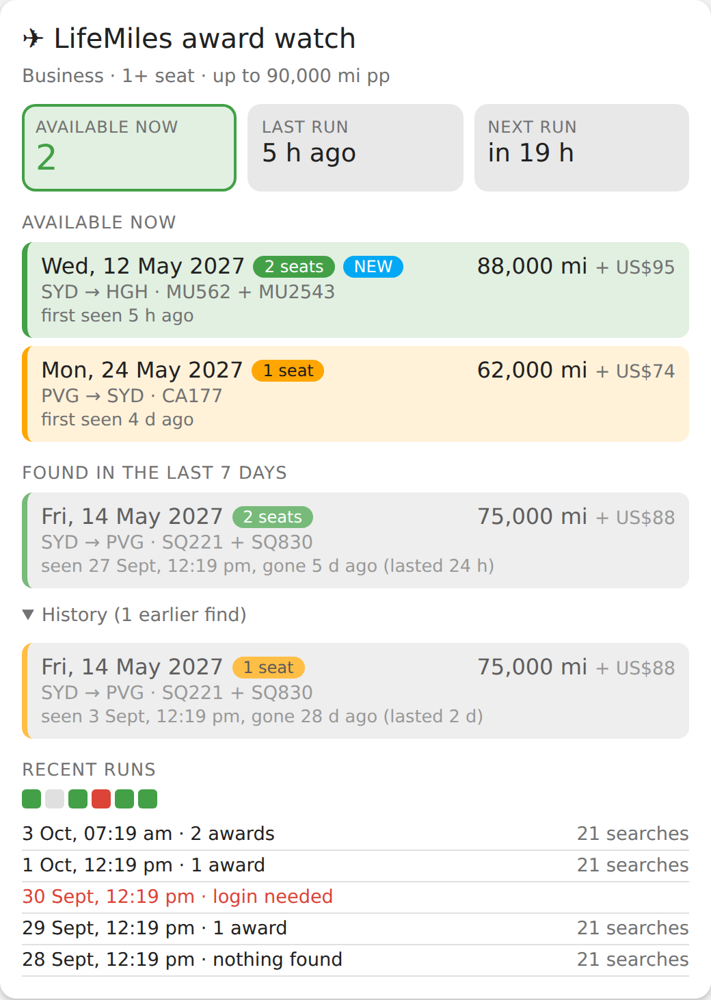
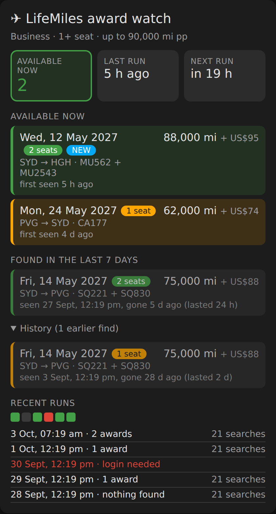

# LifeMiles Watch Card

A Home Assistant dashboard card for a LifeMiles award-space watcher. It shows what is
available **now**, what was found in the last week (even if it has since gone), older finds under
"History", and the recent runs, with problems such as an expired login in red.

| Light | Dark |
|---|---|
|  |  |

*(Preview images use made-up example data.)*

- Rows are coloured by seats: **green = 2 or more seats**, **amber = 1 seat**.
- A **NEW** tag marks anything first seen in the last 24 hours.
- Colours come from your Home Assistant theme, so light and dark themes both work.
- One file, no build step, no dependencies.

> This repository contains only the card. It needs a sensor that publishes the watcher's status
> (see [The sensor](#the-sensor)); the watcher itself is not part of this repository.

## Install with HACS

1. HACS -> three dots -> **Custom repositories**.
2. Repository `https://github.com/yihuigu/lifemiles-watch-card`, category **Dashboard**.
3. Open **LifeMiles Watch Card** in HACS and click **Download**, then reload the browser.

HACS adds the resource itself. If you manage resources by hand, add
`/hacsfiles/lifemiles-watch-card/lifemiles-watch-card.js` as a JavaScript module.

## Add the card

```yaml
type: custom:lifemiles-watch-card
entity: sensor.lifemiles_watch
```

| Option | Default | Meaning |
|---|---|---|
| `entity` | required | the sensor described below |
| `title` | `LifeMiles award watch` | card heading |
| `recent_days` | `7` | how long a gone award still counts as "recent" |
| `max_history` | `10` | older finds listed under "History" |
| `max_runs` | `5` | runs listed under "Recent runs" |

## The sensor

The state is the number of awards available right now. Everything else is attributes. A REST
sensor that polls the watcher's `/status.json` does it:

```yaml
rest:
  - resource: http://<WATCHER-HOST>:8099/status.json
    scan_interval: 300
    sensor:
      - name: "LifeMiles watch"
        unique_id: lifemiles_watch
        unit_of_measurement: "awards"
        value_template: "{{ value_json.count }}"
        json_attributes: [last_run, next_run, config, runs, current, history]
```

Attribute shapes (all timestamps are ISO 8601, `depart` is a date):

```text
last_run, next_run   "2026-10-03T00:31:37+00:00"   (next_run may be null while a run is in progress)
config               {pax, min_seats, max_miles_pp, interval_hours, watches: [...]}
runs                 newest first: {at, ok, secs, attempts, errors, alerts, found, note?}
current              {origin, dest, depart, flights, miles_pp, taxes_usd, seats, first_seen}
history              the same plus gone_at, newest first
```

Keep the attributes under Home Assistant's 16 KB limit (about 30 `history` entries is safe).

## Updating

HACS shows new releases as updates. After updating, hard-refresh the browser so it loads the new
file.
